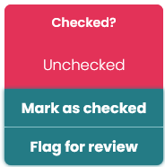

The process of checking a funder for inclusion in UK Grantmaking for a given year involves determining:

- whether it is appropriate to include the organisation in UK Grantmaking
- if they are included, what segment should they be in, and what tags should be applied
- marking whether they make grants to individuals
- Checking, editing or adding financial details (such as their grantmaking) - [Shown in "Checking a Funder Year"](checking_a_funder_year)

The process takes place in the edit page for a given grantmaker, for example the record for the [Wellcome Trust](/grantmakers/funder/GB-CHC-210183/).

## Marking a grantmaker as included or excluded

The "Status" box in the header shows whether a funder is currently included or excluded. Click the button at the bottom of this box to toggle the status.

## Marking a grantmaker as making grants to individuals

Use this box to mark a grantmaker as making grants to individuals. This box is automatically ticked if "Grants to individuals" is greater than zero.

## Change the funder segment

Use the dropdown menu to change the segment of a funder.

## Edit name

The funder's name can be edited by clicking "Edit name" in the title. If the new name is different to the original registered name then the original name will be displayed below.

## Edit funder tags

The tags given to a funder can be edited. Click the "Edit" button to bring up the full list of tags as toggles. Tags marked in Green are currently assigned. Toggle tags on and off as required, and then click "Save" to save the choices.

### Create a new tag

To create a new tag, you need to use the "Admin" section of the site to navigate to the "Funder Tag" pages. You can find the Admin link in the bottom left, then click "+Add" next to "Funder tags" in the "UK Grantmaking" menu.

You can also [navigate directly to the add tag page](/admin/ukgrantmaking/fundertag/add/).

The "slug" for the tag should include only lowercase characters (a-z), numbers and a dash `-`.

Once the tag is saved it should appear in the edit tag section of the funder page.

### Bulk import tags from csv file

Tags can also be imported from a csv file formatted in two columns headed org_id and tag.  

Navigate to [Upload data tags](https://uk-grantmaking-data.360dokku1.vs.mythic-beasts.com/grantmakers/upload).  Choose your file and click upload.

## Add a note

Use the "Add note" box to add a note about this funder. This should record any decision making about whether to include or exclude the funder, which segment to put it in, or any complications with the data entry process.

## Check and edit the financial data

For more details see ["Checking a Funder Year"](checking_a_funder_year)

## Mark as checked / mark for review

Once you are happy that you have checked and edited a funder, you can mark as checked.

If you want to flag the record for review by someone else then you can also mark for review.

## Audit trail

The table at the bottom of the page shows a history of when the funder was edited and by who, with a description of what was changed.
