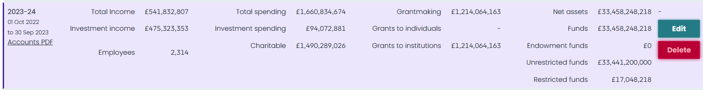
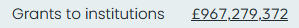
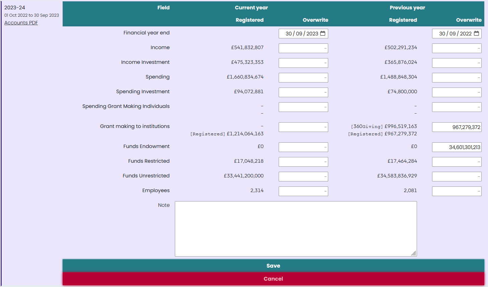

Like general checking of a funder, checking and editing a financial year is done from the [edit page for a given grantmaker](checking_a_funder).

The process usually involves examining a grantmaker's accounts to find financial details, particularly looking at its grantmaking. These details are used to supplement and correct data provided by regulators (such as the Charity Commission) and information from 360Giving publishers.

## Finding the funder year

A table of funder years is shown on the main edit page for a funder, for example the record for the [Wellcome Trust](/grantmakers/funder/GB-CHC-210183/), under the "Financial years" header.

In most cases, there should be a record with a purple backdrop. This will usually be the first record, but might be the second one in some cases. This record represents the Funder Year for the current financial year.

The row shows the current state of the data, usually brought through from regulator data. If data has been manually edited then the number is shown underlined.

If the funder is registered with the Charity Commission for England and Wales then a link to the accounts for that financial year is shown on the left side.

## Editing a funder year

Clicking "Edit" on the right hand side will show a form to edit the data.

This form has two columns - one for the current year values, and one for the previous financial year. This is because accounts usually restate the previous year alongside the current figures, so it is possible to fill in both figures at once. Each column shows the current registered values in the database, plus gives a box for overriding the value with your own value.

Editing the data is done by filling in the boxes, and then clicking save. Don't change the Financial Year End unless it is incorrect.

### How the overwrite works

Any figures entered in the "Overwrite" box will be saved to the database. If the cell is blank (no value at all) then it will be set to Null and the registered figure will be used instead. If the cell has a zero in it (the character `0`) then the value will be set to zero, even if the registered figure is greater than zero.

| Registered value | Overwrite value | Result |
| ---------------- | --------------- | ------ |
| 1,234            |                 | 1,234  |
| 1,234            | 0               | 0      |
| 1,234            | 2,345           | 2,345  |
|                  | 2,345           | 2,345  |
|                  |                 | `NULL` |

The result figure is the one that will be used in UK Grantmaking.
