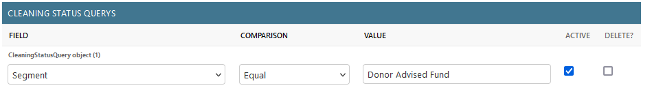

Cleaning tasks are used to show a set of Grantmakers or Grants, and show how many of them have been checked.

They are designed to allow for selection based on criteria, and also allow for the list to be sorted and for a certain number of records to be shown.

The list of cleaning tasks show [under "Grantmakers" > "Tasks"](/grantmakers/tasks/) shows each cleaning task along with what proportion of the funders on the list have been checked.

## Creating a cleaning task

To create a cleaning task, use the Django admin section ("Admin" > "UK Grantmaking" > "Cleaning checks" > "+ Add") or visit [the add new cleaning task page](/admin/ukgrantmaking/cleaningstatus/add/).

The task needs a name, and you can also choose the order to sort it by ("Sort by") and how many records it will consist of ("N").

### Setting the query

You then need to add queries to the task to determine which grantmakers will be included. Set the "Field", "Comparison" and "Value" fields to determine these. You may need to test that they produce the results you are looking for.

